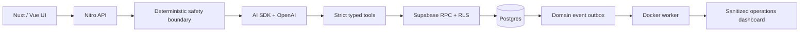

# CareGuide

CareGuide is a production-shaped AI healthcare booking agent built as an original portfolio concept. It turns a conversation into a typed booking workflow while keeping clinical decisions and final authorization outside the model.

> This repository contains synthetic people, schedules, bookings, and metrics only. It is not affiliated with a healthcare provider. Never enter real personal or medical information.

## What the demo proves

- Nuxt 4 and Vue generative UI with Vercel AI SDK streaming.
- OpenAI Responses tool calling with strict Zod contracts.
- Deterministic clinical, emergency, and prompt-injection boundaries.
- Explicit approval before every booking write.
- Transactional five-minute slot holds and idempotent confirmations.
- Supabase migrations, RLS, controlled RPCs, event outbox, and worker.
- Sanitized agent traces, eval gates, and production health checks.
- Hardened Docker Compose deployment behind host Nginx and Certbot.

The app remains usable without credentials through its synthetic guided-booking workspace. `/api/health/ready` fails closed when production mode is enabled without the required OpenAI, Supabase, session, or worker configuration.

## Local development

Requirements: Node.js 22+, pnpm through Corepack, and Docker for local Supabase/container checks.

```bash
corepack enable
corepack pnpm install
cp .env.example .env
corepack pnpm dev
```

Open:

- `http://localhost:3000/` — booking agent and guided workflow
- `http://localhost:3000/ops` — sanitized operational dashboard
- `http://localhost:3000/case-study` — product and architecture rationale

Verification:

```bash
corepack pnpm lint
corepack pnpm typecheck
corepack pnpm test
corepack pnpm eval:fixtures
corepack pnpm build
corepack pnpm test:e2e
```

Live model evals are intentionally separate because they consume API credits:

```bash
NUXT_OPENAI_API_KEY=... corepack pnpm eval:live
```

## OpenAI configuration

The server uses `@ai-sdk/openai` with the Responses API. The default is `gpt-5.4-mini`, low reasoning effort, low verbosity, no OpenAI response storage, no parallel tool calls, and a six-step ceiling.

```dotenv
NUXT_OPENAI_API_KEY="..."
NUXT_OPENAI_MODEL="gpt-5.4-mini"
NUXT_PROMPT_VERSION="booking-agent-v1"
```

The key is server-only. Never prefix it with `NUXT_PUBLIC_`.

## Supabase setup

Create a managed Supabase project in an EU region. Copy only the public URL and publishable key into the browser-safe variables shown in `.env.example`. Privileged production values belong only in the untracked `.env.production`; see [Production operations](docs/production.md).

Link and inspect an existing project:

```bash
corepack pnpm exec supabase login
corepack pnpm exec supabase link --project-ref your-project-ref
corepack pnpm exec supabase db pull
```

Create and test migrations:

```bash
corepack pnpm exec supabase migration new add_feature
corepack pnpm exec supabase start
corepack pnpm exec supabase db reset
```

Apply migrations:

```bash
corepack pnpm exec supabase migration up
corepack pnpm exec supabase db push --dry-run
corepack pnpm exec supabase db push
```

Generate real database types after linking:

```bash
corepack pnpm exec supabase gen types typescript --project-id your-project-ref > app/types/database.types.ts
```

Review pulled and generated changes before committing. `NUXT_PUBLIC_*` values are exposed to browsers, so they must never contain service-role keys, secret keys, database passwords, or access tokens. RLS and RPC boundaries protect access made with the publishable key.

## Architecture



Structured catalog and availability retrieval is intentional: scheduling data is relational, freshness-sensitive, and better served by indexed SQL than embeddings. The small operational FAQ corpus uses approved full-text retrieval. No clinical content is generated or retrieved.

## Docker

The production image is a multi-stage Node 22 Bookworm build. It runs as UID/GID `10001`, uses a read-only filesystem, drops capabilities, and contains only Nitro and the bundled worker output.

```bash
docker build -t careguide:local .
ENV_FILE=.env.production docker compose -f compose.production.yml up -d app worker
curl -fsS http://127.0.0.1:7100/api/health/live
```

The worker requires production Supabase credentials. For an app-only local smoke test, start only `app` with demo mode enabled.

## Production and application material

- [VPS deployment, secrets, rollback, and incident runbook](docs/production.md)
- [Security and privacy decisions](docs/security.md)
- [Evaluation methodology](docs/evals.md)
- [Two-minute demo script](docs/demo-script.md)

The public concept is English-only and deliberately excludes real EHR/calendar integrations, payments, Strapi, real patient data, clinical advice, and German localization.
